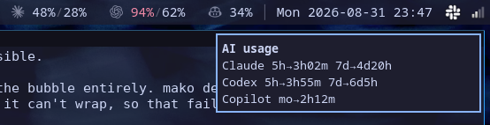

# i3status-rs-ai-usage

AI subscription quota in your status bar, as an [`i3status-rust`][i3rs]
`custom` block. Like `ai-usagebar` / `waybar-ai-usage`, but for the
i3status-rust stack instead of Waybar — so it works with **swaybar** on sway
and **i3bar** on i3, unchanged.

[i3rs]: https://github.com/greshake/i3status-rust

```
CL 12%/24%   CX 100%/47%   CP 34%
```



*Vendor logos and text labels are both supported; the right click reports when
each quota window resets.*

| | Provider | Windows shown |
|---|---|---|
| `CL` | Claude Pro / Max | 5-hour session · 7-day |
| `CX` | ChatGPT Plus / Pro (Codex) | 5-hour session · weekly |
| `CP` | GitHub Copilot (incl. Enterprise) | monthly premium requests |

Numbers are **percent of quota consumed**. Each provider is coloured
independently — normal, orange past `warn_at`, red past `critical_at` — using
pango markup inside a single block, so one bad provider does not repaint the
others.

Python 3.11+, standard library only. No daemon required.

---

## Requirements

- **Python 3.11+** — standard library only, no pip packages.
- **i3status-rust** — for the `custom` block; tested on 0.36.1.
- A bar that renders pango markup: **swaybar** (sway) or **i3bar** (i3).

Optional: `github-cli` (a fallback for reading the Copilot quota),
`libnotify` (for the right-click breakdown) and `otf-font-awesome` (for
[vendor logos](#vendor-logos)). No icon font is needed for the default
labels, which are plain ASCII.

You only need credentials for the services you actually use — see
[Where the numbers come from](#where-the-numbers-come-from). Providers you do
not subscribe to can be removed from `providers` in the config.

## Install

### Arch Linux

Available in the [AUR](https://aur.archlinux.org/packages/i3status-rs-ai-usage):

```sh
paru -S i3status-rs-ai-usage    # or: yay -S i3status-rs-ai-usage
```

Or by hand:

```sh
git clone https://aur.archlinux.org/i3status-rs-ai-usage.git
cd i3status-rs-ai-usage
makepkg -si
```

### Manual

```sh
install -Dm755 i3status-rs-ai-usage ~/.local/bin/i3status-rs-ai-usage
```

Make sure `~/.local/bin` is on your `PATH`.

### Check it works

Check it can see the services you subscribe to:

```sh
i3status-rs-ai-usage show
```

```
claude   5h  12.0% (resets in 4h45m)   7d  24.0% (resets in 4d21h)  · pro
codex    5h 100.0% (resets in 26m)     7d  47.0% (resets in 6d7h)   · plus
copilot  mo  33.9% (resets in 3h55m)   · enterprise · premium_interactions 24458/37000 left
```

## Wire it into i3status-rust

Append `examples/i3status-rust.toml` to your config (e.g.
`~/.config/i3status-rust/mocha.toml`), then reload your compositor
(`swaymsg reload`, or `i3-msg reload`):

```toml
[[block]]
block = "custom"
command = "i3status-rs-ai-usage render"
json = true
interval = 30

[[block.click]]
button = "left"
cmd = "i3status-rs-ai-usage poll --quiet"

[[block.click]]
button = "right"
cmd = "notify-send 'AI usage' \"$(i3status-rs-ai-usage show --cached --brief)\""
```

`interval = 30` is safe. `render` never touches the network: it prints a
cached reading (~100 ms, mostly interpreter startup) and forks a refresh in
the background only when the cache has aged past `refresh_interval`. A single
lock file ensures concurrent renders spawn at most one refresh.

If you would rather the bar never fork anything, enable the timer instead and
add `--no-refresh` to the command:

```sh
install -Dm644 systemd/i3status-rs-ai-usage.{service,timer} -t ~/.config/systemd/user/
systemctl --user enable --now i3status-rs-ai-usage.timer
```

---

## Where the numbers come from

**Claude** — `GET https://api.anthropic.com/api/oauth/usage`, using the OAuth
access token in `~/.claude/.credentials.json`. This is the same data behind
`/usage` in Claude Code.

> **One caveat worth knowing.** That access token is short-lived (~8 h) and
> Claude Code refreshes it whenever it runs. This tool deliberately **does
> not** refresh it: rotating the refresh token from outside the CLI could
> invalidate Claude Code's own session. So if you go a long stretch without
> running `claude`, the block shows a red `CL !` until you next start it. That
> is a conscious trade of a cosmetic glitch against the risk of logging you
> out. Run `i3status-rs-ai-usage show` to see `token expired (run claude)`.

**Codex** — read from the newest session rollout file under
`~/.codex/sessions/**.jsonl`. The Codex CLI records the server's rate-limit
response into every session, and there is no usable HTTP alternative:
`chatgpt.com/backend-api` sits behind Cloudflare and returns 403 to anything
that is not the CLI.

Two consequences. Rollout files reach tens of megabytes, so the file is read
**backwards** from the end rather than parsed whole. And a reading is only as
recent as your last Codex run — which is fine, because Codex usage only
accrues while Codex runs. If a window's reset time has passed, the window has
rolled over and is reported as `0%`; `show` labels that `(window rolled
over)`.

**Copilot** — `GET https://api.github.com/copilot_internal/user`, using the
OAuth token in `~/.config/github-copilot/apps.json`, falling back to
`gh api` if that is missing. The tool reports the first **metered** quota
bucket, which on Enterprise and Pro seats is `premium_interactions`. Seats
where everything is flagged unlimited render as `CP ∞` rather than a fake
number.

Nothing is ever sent anywhere: each credential goes only to the service it
already belongs to.

---

## Configuration

Optional, `~/.config/i3status-rs-ai-usage/config.json`. Defaults:

```json
{
  "providers": ["claude", "codex", "copilot"],
  "refresh_interval": 180,
  "stale_after": 900,
  "warn_at": 75,
  "critical_at": 90,
  "colors": {
    "normal":   "#cdd6f4",
    "warn":     "#fab387",
    "critical": "#f38ba8",
    "label":    "#7f849c",
    "dim":      "#585b70",
    "error":    "#f38ba8"
  },
  "labels": { "claude": "CL", "codex": "CX", "copilot": "CP" },
  "markup": "pango",
  "separator": "  ",
  "show_short_window": true,
  "show_reset": false
}
```

Notable keys:

- **`providers`** — drop the ones you do not pay for; they simply disappear.
- **`show_short_window`** — `false` shows only the long window (`CL 24%`),
  which is much narrower on a busy bar.
- **`show_reset`** — `true` appends a countdown to whichever window is closest
  to exhaustion: `CX 100%/47% (26m)`.
- **`stale_after`** — how long a *failed refresh* may persist before the
  reading is dimmed. This tracks failure to refresh, **not** the age of the
  underlying observation, so Codex data from this morning is not falsely
  greyed out.
- **`labels`** / **`label_font`** — see [Vendor logos](#vendor-logos) below.
- **`markup`** — set to `"plain"` (or pass `--plain`) to drop pango markup and
  let i3status-rust colour the whole block from its `state` instead.

The default colours are Catppuccin Mocha, matching the theme in
`examples/i3status-rust.toml`.

---

## Vendor logos

The labels are plain strings, so they can be glyphs instead of `CL`/`CX`/`CP`.
[Font Awesome 7 Brands][fa] ships real marks for all three vendors:

| Provider | Font Awesome name | Codepoint |
|---|---|---|
| Claude | `claude` | `U+E861` |
| OpenAI / Codex | `openai` | `U+E7CF` |
| Copilot | `copilot` | `U+E8C7` |


The glyphs are not reproduced literally above because they live in the Unicode
private use area, and no font GitHub serves contains them — they would render
as blank boxes here however they were written. Copy
`examples/config-icons.json` rather than the codepoints, and they will be
correct.

Install the font (`otf-font-awesome` on Arch, `fonts-font-awesome` on Debian),
then copy `examples/config-icons.json` to
`~/.config/i3status-rs-ai-usage/config.json`:

```json
{
  "label_font": "Font Awesome 7 Brands",
  "labels": { "claude": "", "codex": "", "copilot": "" },
  "separator": "   "
}
```

**`label_font` matters.** These glyphs live in the Unicode private use area,
which is a free-for-all: on a typical desktop the same codepoints are also
claimed by CJK fonts, Junicode and IBM Plex Sans TC. Leaving the pick to
fontconfig can silently render an unrelated glyph, and which one you get
varies by machine. Naming the face pins it, and it applies to the label only —
the numbers still use your bar font.

If you would rather not install a font, these Unicode approximations need
nothing extra: `✳` (U+2733), `❋` (U+274B), `✻` (U+273B).

[fa]: https://fontawesome.com/

## Behaviour when things break

The bar is never allowed to lose its line.

- **Provider unreachable / token expired** — the last good reading is kept and
  dimmed rather than discarded, so a brief network drop does not blank the
  block. `show` reports `!! last refresh failed: …`.
- **No reading at all** — that provider renders as a red `CL !`, with block
  state `warning`, not `critical`; a broken login should not look the same as
  a genuinely exhausted quota.
- **Cold start, cache not yet written** — renders as `CL …`.
- **Corrupt cache or config** — ignored, with a note on stderr; the block
  still renders.

## Commands

| | |
|---|---|
| `render` | one line of i3status-rust JSON, from cache (`--no-refresh`, `--plain`) |
| `poll` | refresh the cache; this is the part that uses the network |
| `show` | human-readable breakdown (`--cached` to skip the network, `--brief` for reset times only, sized for a notification) |
| `watch` | refresh forever, for the systemd service |

All accept `--providers claude,codex`.

## Uninstall

```sh
rm -f ~/.local/bin/i3status-rs-ai-usage          # or: pacman -Rns i3status-rs-ai-usage
rm -rf ~/.config/i3status-rs-ai-usage ~/.cache/i3status-rs-ai-usage
```

Then remove the block from your i3status-rust config.

## Contributing

Adding a provider means writing one `fetch_*` function returning a `Usage`
with one or more `Window`s, and registering it in the `PROVIDERS` dict.
Everything else — caching, colouring, staleness, failure retention — is shared.

Issues and pull requests welcome.

## Licence

GNU General Public License v3.0 or later. See [LICENSE](LICENSE).
